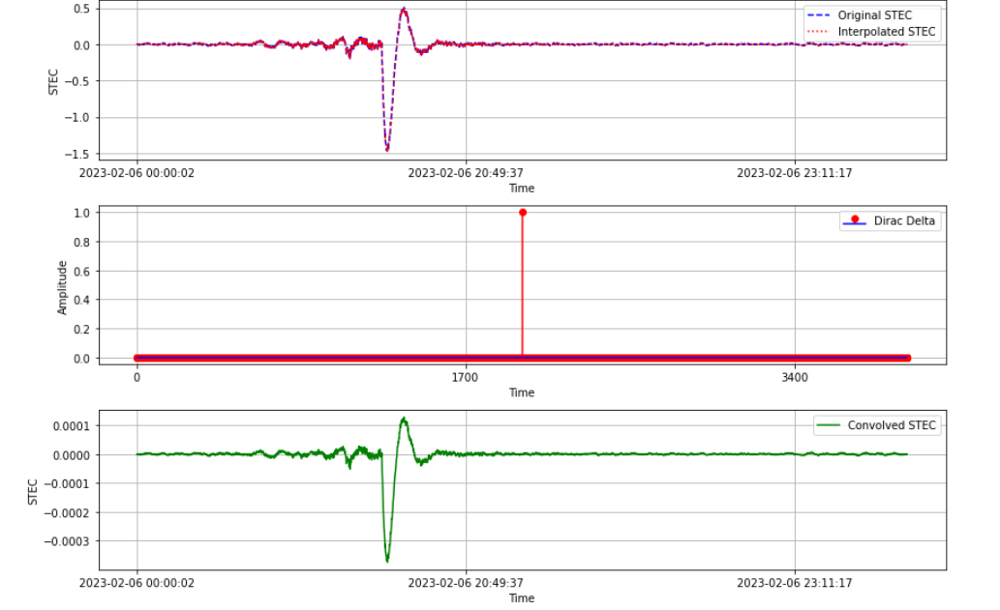
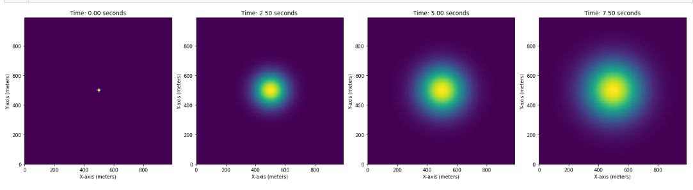

# Computing-and-data-analysis

*Caption for Image 1*

*Caption for Image 2*

*Caption for Image 3*

## Project Summary

This goal of this project is to try and simulate the wavefront propagation in the Ionosphere using the convolution with a dirac and the Finit element method.

## Getting Started

## Usage

