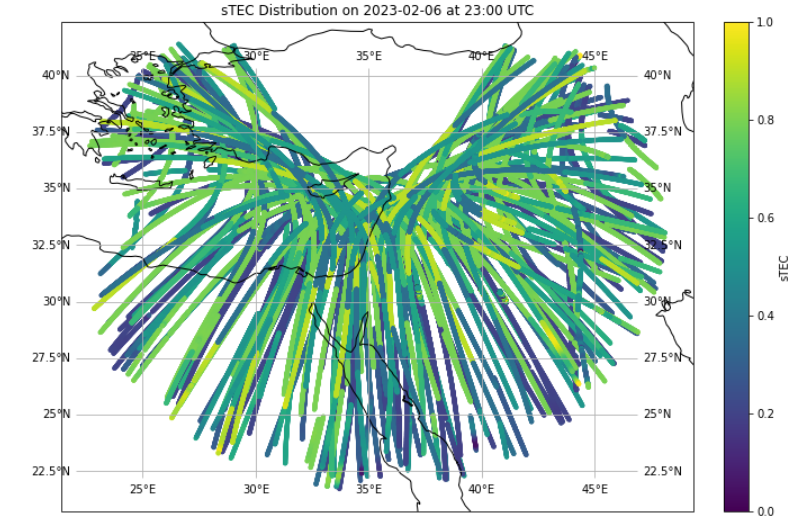

# Computing-and-data-analysis

![Project Image 1][width=5cm](simulation1.png)
*Caption for Image 1*

*Caption for Image 2*

*Caption for Image 2*

## Project Summary

This goal of this project is to try and simulate the wavefront propagation in the Ionosphere using the convolution with a dirac and the Finit element method.

## Getting Started

## Usage

